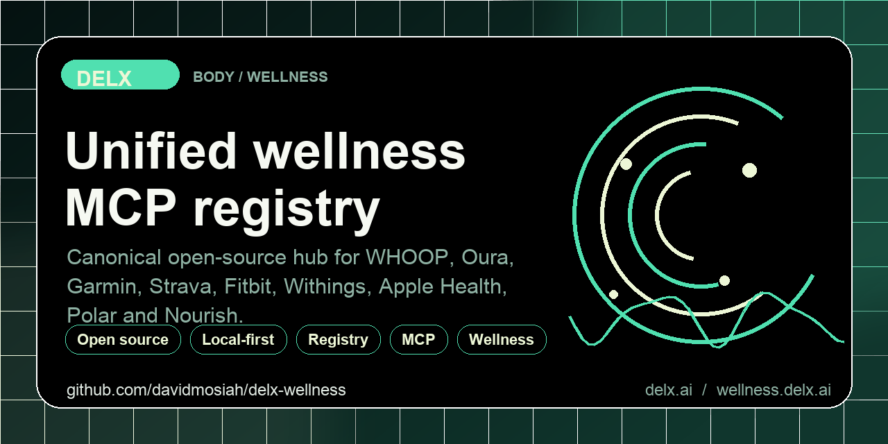

<!-- delx-wellness header v2 -->
<h1 align="center">Samsung Health MCP</h1>

<div align="center">
  
</div>

<h3 align="center">
  Read your Samsung Health CSV/ZIP exports &mdash; activity, sleep, heart, stress &mdash; locally.<br>
  Local-first MCP server &mdash; <strong>tokens never leave your machine</strong>.
</h3>

<p align="center">
  <a href="https://www.npmjs.com/package/samsung-health-mcp-unofficial"></a>
  <a href="https://www.npmjs.com/package/samsung-health-mcp-unofficial"></a>
  <a href="LICENSE"></a>
  <a href="https://wellness.delx.ai/connectors/samsung-health"></a>
</p>

<p align="center">
  <a href="https://github.com/davidmosiah/samsung-health-mcp/stargazers"></a>
  <a href="https://modelcontextprotocol.io"></a>
  <a href="https://github.com/davidmosiah/delx-wellness-hermes"></a>
  <a href="https://github.com/davidmosiah/delx-wellness"></a>
</p>

> ⚡ **One-command install** with [Delx Wellness for Hermes](https://github.com/davidmosiah/delx-wellness-hermes):
> `npx -y delx-wellness-hermes setup` &mdash; preconfigures this connector and the other 8 in a dedicated Hermes profile.
>
> Or wire it standalone into Claude Desktop / Cursor / ChatGPT Desktop &mdash; see the install section below.

---

<!-- /delx-wellness header v2 -->

**Unofficial local-first MCP server that reads Samsung Health personal-data CSV/ZIP exports and exposes them safely to AI agents.**

> **Unofficial project.** Not affiliated with, endorsed by, or supported by Samsung Electronics. Samsung Health is a trademark of Samsung Electronics. This package reads exports you generate yourself from the Samsung Health app.

> **No live Samsung Health cloud API.** Samsung has Android SDK paths for partner apps, but this Node MCP does not log into Samsung, scrape accounts, or read Health Connect directly. It reads local exports now; a future Android bridge can sit beside it.

Built by [David Mosiah](https://github.com/davidmosiah) as part of [Delx Wellness](https://github.com/davidmosiah/delx-wellness), a registry of local-first wellness MCP connectors for Claude, Cursor, Hermes, OpenClaw and other MCP-compatible agents.

## Why this exists

Samsung Health can collect high-signal wellness data from Galaxy Watch, Galaxy Ring and phones: steps, sleep, exercise, heart rate, oxygen saturation, body measurements and more. Samsung's official Health Data SDK can access many of these data types from Android apps with user permission, but distribution requires the Samsung app process and partnership flow. For a desktop MCP today, the reliable privacy-preserving path is a local personal-data download.

This connector reads that download locally, supports a folder of CSV files, a single CSV, or a zip containing CSV files, then exposes bounded summaries and records through MCP. No Samsung credentials, no OAuth token, no cloud proxy.

## Setup In 60 Seconds

1. On Android, export data from Samsung Health:

```text
Samsung Health -> More options -> Settings -> Download personal data
```

2. Transfer the downloaded Samsung Health folder or zip to this machine.

3. Configure and verify:

```bash
npx -y samsung-health-mcp-unofficial setup --export-path /path/to/SamsungHealth
npx -y samsung-health-mcp-unofficial doctor
```

Or let the CLI find the newest local Samsung Health export in `Downloads`, `Desktop` or `Documents`, copy it into managed local storage, and save that path:

```bash
npx -y samsung-health-mcp-unofficial setup --auto-import
```

Supported export paths:

- `/path/to/SamsungHealth/` or another folder containing CSV files
- `/path/to/samsung_health_export.zip`
- `/path/to/com.samsung.health.step_count.csv`

Then add this to your MCP client config:

```json
{
  "mcpServers": {
    "samsung_health": {
      "command": "npx",
      "args": ["-y", "samsung-health-mcp-unofficial"]
    }
  }
}
```

For Claude Desktop, run `setup --client claude --export-path /path/to/SamsungHealth` and the snippet is written for you.

## Try It With Your Agent

```text
Use samsung_health_connection_status to check setup, then run samsung_health_daily_summary.
Give me a 5-line wellness brief for today.
```

```text
Call samsung_health_data_inventory first. What Samsung Health signals and date ranges
are available in this export?
```

```text
Call samsung_health_weekly_summary with response_format=json. Compare steps,
sleep, workouts and heart signals across the last 7 days.
```

## Data Availability

The parser is intentionally flexible because Samsung personal-data downloads can vary by app version, locale and device. It infers record types from CSV filenames and headers.

| Data | Available | Notes |
|---|:---:|---|
| Steps | yes | `samsung_health_steps` |
| Distance + active energy | yes | When present in CSVs or exercise rows |
| Heart rate + resting heart rate | yes | Galaxy Watch exports when available |
| HRV, respiratory rate, oxygen saturation | yes | Device and region dependent |
| Sleep + sleep stages | yes | Galaxy Watch sleep exports when available |
| Workouts / exercise | yes | Duration, distance, calories and activity type |
| Body weight + body fat | yes | When logged or synced |
| Live Health Connect read | no | Planned separate Android bridge |
| Samsung account login | no | Deliberately unsupported |

## Tools

Start with these:

- `samsung_health_connection_status` - verify export path before reading data
- `samsung_health_data_inventory` - discover available record types, date coverage, source count and stale export risk
- `samsung_health_daily_summary` - daily wellness brief from export data
- `samsung_health_weekly_summary` - weekly comparison and habit signals

Diagnostics:

- `samsung_health_capabilities`
- `samsung_health_agent_manifest`
- `samsung_health_privacy_audit`

Records:

- `samsung_health_list_records` - bounded records by `type`, `start`, `end`, `limit`
- `samsung_health_list_workouts` - bounded workout records

## Prompts And Resources

Prompts:

- `samsung_health_daily_review`
- `samsung_health_weekly_review`

Resources:

- `samsung-health://capabilities`
- `samsung-health://agent-manifest`
- `samsung-health://inventory`
- `samsung-health://summary/daily`
- `samsung-health://summary/weekly`

## Privacy And Safety

- Samsung Health exports are sensitive personal health data. Keep them local.
- Never commit Samsung Health CSV/ZIP exports to GitHub, paste raw exports into chat, or upload them to issues.
- The export path is read-only; the MCP never modifies your source export.
- `SAMSUNG_HEALTH_PRIVACY_MODE` defaults to `summary`; raw record dumps are opt-in.
- This is not medical advice. The server exposes data you exported yourself for personal AI workflows, not diagnosis or emergency monitoring.

## Configuration

```bash
SAMSUNG_HEALTH_EXPORT_PATH=/path/to/SamsungHealth  # folder, csv, or zip
SAMSUNG_HEALTH_PRIVACY_MODE=summary                # summary | structured | raw
SAMSUNG_HEALTH_TIMEZONE=America/Fortaleza          # local-day summaries
```

`setup` writes these settings into `~/.samsung-health-mcp/config.json` with `0600` permissions.

`setup --auto-import` scans common local folders for the newest Samsung Health export and copies it to `~/.samsung-health-mcp/exports/` with restrictive permissions. Fully live Samsung Health sync still requires a separate Android bridge.

## Hermes / Remote Setup

```bash
npx -y samsung-health-mcp-unofficial setup --client hermes --export-path /path/to/SamsungHealth
npx -y samsung-health-mcp-unofficial doctor --client hermes
hermes mcp test samsung_health
```

After Hermes config changes, use `/reload-mcp` or `hermes mcp test samsung_health`. Don't restart the gateway for normal export access.

## Development

```bash
git clone https://github.com/davidmosiah/samsung-health-mcp.git
cd samsung-health-mcp
npm install
npm test
```

Optional local HTTP transport:

```bash
SAMSUNG_HEALTH_MCP_TRANSPORT=http SAMSUNG_HEALTH_MCP_PORT=3000 node dist/index.js
curl http://127.0.0.1:3000/health
```

## Official References

- Samsung personal-data export: <https://www.samsung.com/us/support/answer/ANS10001379/>
- Samsung Health Data SDK: <https://developer.samsung.com/health/data/overview.html>
- Samsung Health Data SDK app process: <https://developer.samsung.com/health/data/process.html>
- Android Health Connect: <https://support.google.com/android/answer/12201227>

## Links

- npm: <https://www.npmjs.com/package/samsung-health-mcp-unofficial>
- Docs site: <https://wellness.delx.ai/connectors/samsung-health>
- GitHub: <https://github.com/davidmosiah/samsung-health-mcp>
- Delx Wellness registry: <https://github.com/davidmosiah/delx-wellness>
